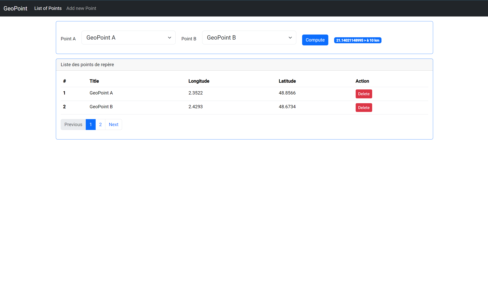
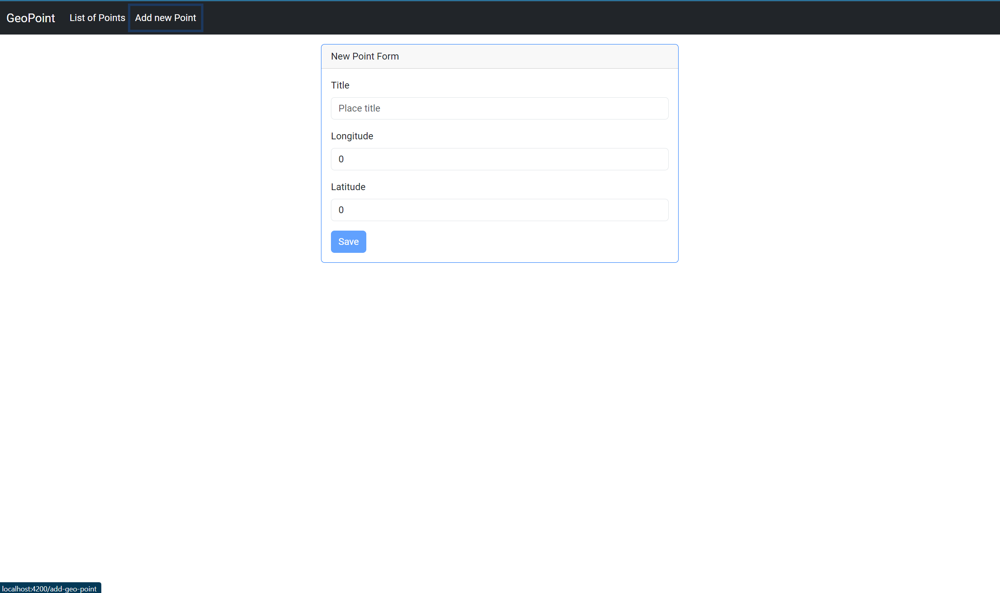

# GPS Coordinate Management System

## Project Description

This is a full-stack application built with Spring Boot (backend) and Angular (frontend) that allows users to manage GPS coordinates. The application provides the following features:

- Record GPS coordinates (latitude and longitude)
- Calculate distances between two GPS coordinates
- View a list of all stored GPS coordinates

### Technical Stack

- **Frontend**: Angular 19
- **Backend**: Spring Boot 3.4.0
- **Database**: PostgreSQL  & PostGIS
- **API Documentation**: Swagger
- **Containerization**: Docker & Docker Compose

## Getting Started

### Prerequisites

- Docker and Docker Compose
- Node.js 22 (for local development)
- Java 21 (for local development)

### Running with Docker Compose

1. Clone the repository
2. Navigate to the project root directory
3. Run the following command:

```bash
docker compose up -d
```

This will start both the frontend and backend services, along with the database.

### Application Access

- Frontend Application: [http://localhost:4200](http://localhost:4200)
- Backend API: [http://localhost:9092](http://localhost:9092)
- Swagger Documentation: [http://localhost:9092/swagger-ui.html](http://localhost:9092/swagger-ui.html)

## Application Features

### Frontend Pages

1. **Coordinates List** (`/geo-points`)
    - Displays all stored GPS coordinates in a table format
    - Shows ID, latitude, longitude, and title

2. **Add Coordinate** (`/add-geo-point`)
    - Form to input new GPS coordinates
    - Fields for latitude and longitude
    - Validation for coordinate input
    - Success/error feedback on submission

### API Documentation

The complete API documentation is available through Swagger UI at:
[http://localhost:9020/swagger-ui.html](http://localhost:9020/swagger-ui.html)

Key endpoints:
- `GET /api/v1/geo-points?page={pageNumber}&size={pageSize}` - List all coordinates
- `POST /api/v1/geo-points` - Add new Gps coordinate
- `GET /api/v1/geo-points/compute-distance?geoPointIdA={id1}&geoPointIdB={id2}` - Calculate distance between two coordinates
- `DELETE /api/v1/geo-points/{geoPointId}` - Delete a Gps coordinate

## Running Tests

### Backend Tests

```bash
./mvnw test
```

### Frontend Tests

```bash
ng test
```

## Development

### Local Development Setup

1. Backend:
```bash
./mvnw spring-boot:run
```

2. Frontend:
```bash
ng serve
```

## Additional Information

- The backend runs on port 9020 to avoid conflicts with common ports
- The frontend development server runs on port 4200
- All API endpoints are prefixed with `/api/v1`
- The application uses RESTful conventions for API endpoints


## Appearance
- List of Gps Coordinates



- New Gps Coordinate Form

